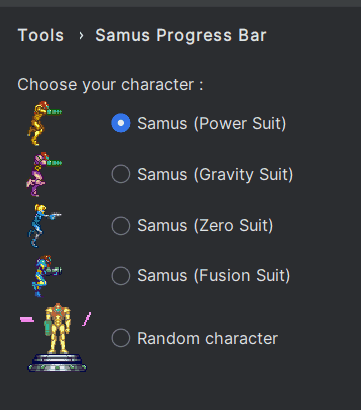

# Samus Progress Bar

## Description

This is the Samus Progress Bar for IJ based IDEs based on the Nyan Progress Bar by Dmitry Batkovitch and Mario Progress Bar by KikiManjaro.
It displays Samus for the basic bar and her Morphball for the indeterminate one.

## Configuration

You can access plugin's configuration in :

Settings > Tools > Samus Progress Bar

You can choose your character here

  

## Acknowledgements

### Sprites
* All sprites belong to Nintendo. Find them on [Spriters-Resource](https://www.spriters-resource.com/)

### Misc
* Gif editing done with [Gimp](https://www.gimp.org/)